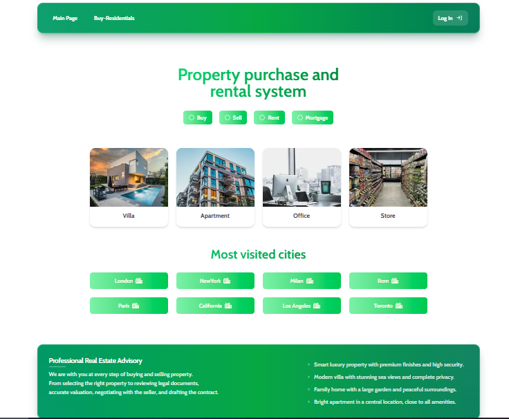

#  Shelterhub — Full-Stack Real Estate Platform


> A full-stack residential property platform built with Next.js and MongoDB, featuring authentication, role-based access control, server-side data fetching, and advanced filtering.

<p align="center">
  
  <br/>
  <em>Shelterhub - Property listing with smart filters</em>
</p>

##  Highlights

Shelterhub is designed to show modern web development practices in a real-world project. Here are the main features:
* **Server-Side Rendering:** Uses Next.js Server Components to render property data on the server, reducing client-side JavaScript and supporting SEO-friendly pages.
* **Authentication & Authorization:** Implements JWT-based authentication with NextAuth.js and role-based access control (RBAC).
* **Smart Filtering:** Handles complex search filters (like categories) directly through URL parameters without flashing empty screens.
* **Mobile-Friendly:** A fully responsive, clean user interface styled with Tailwind CSS.
* **Live & Ready:** Fully functional and deployed on Render for you to test.

##  See it in Action

You can experience the live application right now:

🔗 **Launch Shelterhub:** [https://shelterhub-hq58.onrender.com/](https://shelterhub-hq58.onrender.com/)

##  Overview

Welcome to Shelterhub! This platform allows users to browse, filter, and manage residential property listings. 

I built this project to demonstrate a clean, maintainable architecture for a modern web application. Instead of relying heavily on client-side rendering, Shelterhub connects directly to the database on the server side. This reduces load times and makes every filtered search easily shareable via a simple link. 

##  Built With

- **[Next.js 16.2.6](https://nextjs.org/)** - React framework with App Router
- **[React 19.2.4](https://react.dev/)** - UI library
- **[Mongoose 9.6.3](https://mongoosejs.com/)** - ODM for MongoDB
- **[Tailwind CSS 4.0](https://tailwindcss.com/)** - Utility-first CSS
- **[NextAuth.js 4.24.14](https://next-auth.js.org/)** - Authentication
- **[bcryptjs 3.0.3](https://github.com/dcodeIO/bcrypt.js)** - Password hashing
- **[date-fns 4.4](https://date-fns.org/)** - Date utilities
- **[react-hot-toast 2.6](https://react-hot-toast.com/)** - Toast notifications
- **[react-icons 5.6](https://react-icons.github.io/)** - Icons
- **[react-multi-date-picker 4.5.2](https://github.com/aryan-aneja/React-Multi-Date-Picker)** - Date picker
---

##  Technical Decisions & Trade-offs

Every architectural choice has a reason. Here is why I built Shelterhub this way:

* **Why Next.js Server Components instead of Client-Side Fetching?**
  * **Decision:** Used Server Components for rendering property listings and applying filters.
  * **Alternative Considered:** Client-side fetching (e.g., React Query) or Static Site Generation (SSG).
  * **Reason:** Real estate listings need up-to-date data and strong SEO. Server Components provide both without the complex loading states of client-side fetching. 

* **Why JWT over Database-Backed Sessions?**
  * **Decision:** Used stateless JWT tokens for authentication.
  * **Alternative Considered:** Storing sessions in MongoDB.
  * **Reason:** JWT makes the API horizontally scalable because we do not need to share a database session between server instances. This makes authentication much faster. *Trade-off:* Tokens cannot be invalidated immediately, but I manage this risk by using short expiry times (1 day).

* **Why MongoDB over PostgreSQL?**
  * **Decision:** Chose MongoDB as the primary database.
  * **Alternative Considered:** PostgreSQL or MySQL.
  * **Reason:** Property listings contain flexible and potentially varying attributes, and MongoDB's document model allows these structures to evolve without requiring frequent schema migrations.

---

##  Performance Metrics

To ensure a high-quality user experience, I measured and optimized the application performance:

* **Lighthouse Score:** 91/100 (Performance), 98/100 (Accessibility), 100/100 (Best Practices), 100/100 (SEO)
* **Core Web Vitals:** First Contentful Paint (FCP) at ~2.1s and Largest Contentful Paint (LCP) at ~2.5s.
* **Bundle Size:** Only ~142KB transferred for the initial client payload, highly optimized by leveraging Next.js Server Components.
* **API Response Time:** ~700ms for property fetching and category filtering.
* **Database Optimizations:** Created an index on `{ category: 1 }` in MongoDB for faster and more efficient searches based on property types.

---

##  Project Structure

The code is organized to be clean, modular, and easy to maintain:

```text
shelterhub/
├── src/
│   ├── app/
│   │   ├── api/              # RESTful API routes (Backend Endpoints)
│   │   ├── admin/            # Role-based access (Server Components)
│   │   ├── dashboard/        # User control panel (Protected routes)
│   │   └── auth/             # Login & Register pages
│   ├── components/              
│   │   ├── template/        # Page-level components (Complete page structures)
│   │   ├── module/          # Reusable modules (Small, focused components)
│   │   └── layout/          # Shared structures (Header, Footer,DashboardSiderbar)
│   ├── models/              Mongoose database models
│   ├── providers/           # NextAuth.js session provider
│   └── utils.ts             # Utility functions (MongoDB connection, bcryptjs password hashing and verification)
├── public/                  # Static assets (images, icons, fonts)
├── .env.local               # Environment variables (Never commit this)
└── package.json             # Project dependencies
```

---

##  Installation

**Minimum Requirements:**
* **Node.js:** v20.x or higher
* **MongoDB:** A local database or a cloud account like MongoDB Atlas

First, clone the project and install the dependencies:

```bash
git clone [https://github.com/yeganejhi/nextjs-real-estate-platform.git](https://github.com/yeganejhi/nextjs-real-estate-platform.git)
cd nextjs-real-estate-platform
npm install
```

Next, create a `.env.local` file in the root directory. 
>  **Important:** Never commit your `.env.local` file. Make sure it is in your `.gitignore`.

```env
MONGO_URI=your_mongodb_connection_string
NEXTAUTH_SECRET=your_custom_random_jwt_secret_string  # Minimum 32 characters
NEXT_PUBLIC_BASE_URL=http://localhost:3000
```

Finally, start the development server:

```bash
npm run dev
```

---

##  Quick Test Guide (For Reviewers)

If you do not have time to install the project locally, you can use these pre-configured demo accounts on the live website:

| Role | Email | Password |
|------|-------|----------|
| **Admin** | `admin@shelterhub.com` | `Admin@123` |
| **Regular User** | `user@shelterhub.com` | `User@123` |

**You can also test these core features without logging in:**
* Browse properties using the filters.
* Click on a property card to see detailed information.
* Share a filtered search URL with a friend to see how the URL saves your search state.
* Register a new account (email verification is not required for this demo).

>  **Security Note:** These demo accounts are pre-configured for **development and testing purposes only**. They have limited privileges and are disabled in production. Please do not use them for sensitive data.

---

##  Future Roadmap

Shelterhub is a growing project. Here is what I plan to implement next:

* **Real-Time Notifications:** Add WebSockets (Socket.io) to send instant alerts when new properties match a user's saved search.
* **Caching Layer:** Use Redis to cache popular queries (like the homepage listings) to reduce the database load.
* **Image Optimization:** Move image storage to Cloudinary for automatic resizing and faster loading times.
* **Automated Testing:** Add unit tests (Jest) and End-to-End tests (Playwright) to ensure the code remains reliable.
* **CI/CD Pipeline:** Set up GitHub Actions for automated testing and deployment on every push to the main branch.

---

##  Contributing

Contributions are welcome! If you would like to improve Shelterhub:

1. Fork the repository
2. Create a feature branch (`git checkout -b feature/amazing-feature`)
3. Commit your changes (`git commit -m 'Add amazing feature'`)
4. Push to the branch (`git push origin feature/amazing-feature`)
5. Open a Pull Request

Please make sure to update tests and documentation accordingly.

---

##  Acknowledgments

* **[Next.js Documentation](https://nextjs.org/docs)** - For excellent Server Components guides.
* **[MongoDB University](https://university.mongodb.com/)** - For aggregation pipeline best practices.
* **[Tailwind CSS](https://tailwindcss.com/)** - For making responsive design effortless.
* Special thanks to my academic advisors for their valuable feedback.

---

##  Feedback & Collaboration

I built this software ecosystem from the ground up as a central component of my academic software engineering portfolio. 

I am actively seeking feedback from senior engineers and academic reviewers. If you have suggestions about the architecture, security practices, or code quality, please feel free to open an **Issue** or start a **Discussion**.

**License:** Distributed under the open-source MIT License. You are free to use and adapt this architecture for your own projects.
